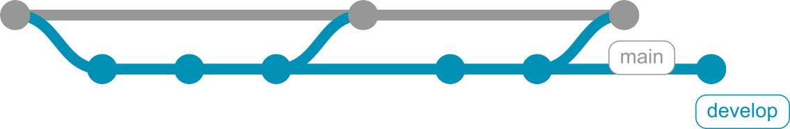
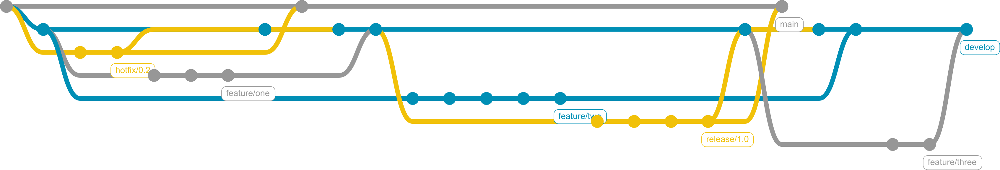

# Versionen dezentral verwalten mit Git

> Dipl.-Ing. (FH) Eugen Richter

---

## Git: Themen

- Warum Versionierung? 
- Geschichte der Versionsverwaltung (allgemein) 
- Geschichte von Git (im besonderen) 
- Übersicht über Versionierungsstrategien 
- Git auf der Console (Kommandozeile) 
- Git mit SourceTree (als Beispiel für eine graphische Oberfläche)

---

## Warum Versionierung?

- Datensicherung
- Älterer Zustand
- Parallele-Arbeit an mehreren Versionen
- Parallele-Arbeit mit mehreren Personen


1. Sicherung der Daten (aktueller Stand)
2. Zurückkehren zum älteren Zustand (jederzeit)
3. Weiterentwicklung / Schreiben, während eine Version stabilisiert / korrigiert wird
4. Arbeiten mit mehreren Personen parallel an einen Projekt


---

## Geschichte der Versionierung

- Zeitstempel-Ordner
- Dateiversionierung 
- Zentral
- Verteilt


- Timestamp
- Versionierung von einzelnen Dateien
	- Word / Excel
- Zentrale Versionsverwaltung
	- SVN
	- TFS
	- CVS
	- MS SourceSafe
- Vertiele Versionsverwaltung
	- Git
	- Mercurial
	- Bitkeeper


---

## Geschichte von git

- 2005 von Linus Torwalds initialisiert 
- Erste Version in wenigen Tagen
- Zur Verwaltung von Linux Kernel (sehr verteilte Entwicklung)
- Sehr hohe Effizienz
- Sehr hohe Sicherheit
- Wegwerf-Zweige


- Nach dem Lizenzänderung von BitKeeper (keine kostenlose Lizenzen für OpenSource Projekte)
- Entwickelt von Linus Torwalds
- In April 2005 gestartet
- In wenigen Tagen erste Version veröffentlicht
- Ausgelegt auf
	- Effizienz
	- Sicherheit
	- Verteilt
	- Wegwerf-Zweige
- Git = Blödman


---

## Versionsstrategien

### Lineare Entwicklung

<!--
const graphContainer = document.getElementById("graph-container");
 
// Instantiate the graph.
const gitgraph = GitgraphJS.createGitgraph(graphContainer, {
  orientation: "horizontal",
  mode: null,
  author: "ER <er@git.de>"
});

// Simulate git commands with Gitgraph API.
const main = gitgraph.branch("main");
main.commit("Init")
  .commit("First Chapter")
  .commit("Day one")
  .tag("v0.1")
  .commit("Day two")
  .commit("Day three")
  .commit("Day four")
  .tag("v0.2");
-->

---

#### Ein Branch - Pro

- Sehr einfache Benutzung
- Kein Merge zwischen unterschiedlichen Zweigen notwendig
- Sehr gut für den Einstieg in die Versionsverwaltung geeignet
- Sehr gut für Dokument-Versionierung (Bücher, Artikel,	Manuskripte usw.)

---

#### Ein Branch - Contra

- Schwer zu handhaben, wenn mehr als nur ein Entwickler beteilig ist, da während des Release-Tests keine Weiterentwicklung für nächste Version möglich ist.
- Hotfixes einer Version sind sehr schwer zu realisieren, da eventuell bereits unvollständige Features für neue Version da sind.

---

## Main - Develop

### Stabliler und Entwicklungszweig

<!--
const graphContainer = document.getElementById("graph-container");
 
// Instantiate the graph.
const gitgraph = GitgraphJS.createGitgraph(graphContainer, {
  orientation: "horizontal",
//  mode: "compact",
  author: "ER <er@git.de>"
});

// Simulate git commands with Gitgraph API.
const main = gitgraph.branch("main");
main.commit("Init");

const develop = gitgraph.branch("develop");

develop.commit("First Chapter")
  .commit("Day one")
  .commit("Day two");
main.merge(develop);
main.tag("v0.1");

develop.commit("Day three")
  .commit("Day four");

main.merge(develop)
  .tag("v0.2");

develop.commit("Day five");
-->

---

#### Main - Devlop - Pro

- Bietet besseren Überblick über ausgelieferte / veröffentlichte Projektstände und belässt die Flexibilität bei der täglichen Arbeit.
- Schneller Zugriff auf benannte Stände, da diese nur im Master-Zweig vertreten sind (ohne Entwicklungsbalast).

---

#### Main - Develop - Contra

- Schwer zu handhaben, wenn mehr als nur ein Entwickler beteilig ist, da während des Release-Tests keine Weiterentwicklung für nächste Version möglich ist.
- Hotfixes einer Version sind sehr schwer zu realisieren, da eventuell bereits unvollständige Features für neue Version da sind.

---

## Git-flow

### master, develop, feature, release, hotfix

<!--
const graphContainer = document.getElementById("graph-container");
 
// Instantiate the graph.
const gitgraph = GitgraphJS.createGitgraph(graphContainer, {
  orientation: "horizontal",
//  mode: "compact",
  author: "ER <er@git.de>"
});

// Simulate git commands with Gitgraph API.
const main = gitgraph.branch("main");
main.commit("Init")
  .tag("0.1");

const develop = main.branch("develop");

develop.commit("Task 1");

const f1 = develop.branch("feature/one");
const f2 = develop.branch("feature/two");

const h1 = main.branch("hotfix/0.2");
h1.commit("Fix 1");
h1.commit("Fix 2");

f1.commit("F1 Task 1")
  .commit("F1 Task 2")
  .commit("F1 Task 3");

develop.commit("Task 2");

main.merge(h1);
main.tag("0.2");

develop.merge(h1);
develop.merge(f1);

f2.commit("F2 Task 1")
  .commit("F2 Task 2")
  .commit("F2 Task 3")
  .commit("F2 Task 4")
  .commit("F2 Task 5");

const r1 = develop.branch("release/1.0");
r1.commit("R1 Fix 1")
  .commit("R1 Fix 2")
  .commit("R1 Fix 3")
  .commit("R1 Fix 4");

develop.commit("Task 3");
const f3 = develop.branch("feature/three");

main.merge(r1)
  .tag("1.0");
develop.merge(r1);

develop.merge(f2);

f3.commit("F3 Task 1")
  .commit("F3 Task 2");

develop.merge(f3);
-->

---

#### Git Flow -- Pro

- Arbeiten im Team ohne Beeinträchtigungen möglich, da Aufgaben in eigenen Zweigen erledigt werden.
- Saubere Implementierung der Hotfixes für Release-Versionen ohne Beeinträchtigung der Entwicklung möglich.
- Paralelles Weiterentwicklen der nächsten Version und vorbereiten (testen) der aktuellen durch Release-Zweige möglich.
- Auslieferung von Hotfixes in sehr kurzer Zeit möglich, da keine Rücksicht auf den Entwicklungsstand genommen werden muss.#

---

#### Git Flow -- Contra

- Komplexere Handhabung als beide vorhergehenden Strategien.
- Momentan wird nur von wenigen graphischen Tools (z.B.: SourceTree unter OS X) direkt unterstützt.
- Erfordert Disziplin beim Entwickeln, da für jede Aufgabe ein neuer Zweig aufgemacht werden muss.
- Nicht geeignet, wenn mehrere Release-Versionen über lange Zeiträume parallel gepflegt werden müssen.

---

## Weitere Strategien

- Forking
- Pull Request
- GitHub Flow


## Forking

- Jeder Entwickler hat eigenes Repository auf dem Server
- Ein einziger kann die Entwicklung in das Haupt-Repository übernehmen
- **Pro**
	- Geeignet bei unsicheren Entwicklern, die nicht in das Original einchecken sollen

## Pull/Merge Requests

- Wie Forking, der Entwickler kann aber eine Änderung dem Original-Repository aktiv vorschlagen.


---

# Workshop