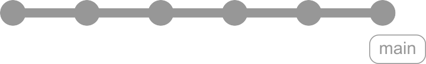

# Versionen dezentral verwalten mit Git

> Dipl.-Ing. (FH) Eugen Richter

---

## Git: Themen

- Warum Versionierung? 
- Geschichte der Versionsverwaltung (allgemein) 
- Geschichte von Git (im besonderen) 
- Übersicht über Versionierungsstrategien 
- Git auf der Console (Kommandozeile) 
- Git mit SourceTree (als Beispiel für eine graphische Oberfläche)

---

## Warum Versionierung?

- Datensicherung
- Älterer Zustand
- Parallele-Arbeit an mehreren Versionen
- Parallele-Arbeit mit mehreren Personen


1. Sicherung der Daten (aktueller Stand)
2. Zurückkehren zum älteren Zustand (jederzeit)
3. Weiterentwicklung / Schreiben, während eine Version stabilisiert / korrigiert wird
4. Arbeiten mit mehreren Personen parallel an einen Projekt


---

## Geschichte der Versionierung

- Zeitstempel-Ordner
- Dateiversionierung 
- Zentral
- Verteilt


- Timestamp
- Versionierung von einzelnen Dateien
	- Word / Excel
- Zentrale Versionsverwaltung
	- SVN
	- TFS
	- CVS
	- MS SourceSafe
- Vertiele Versionsverwaltung
	- Git
	- Mercurial
	- Bitkeeper


---

## Geschichte von git

- 2005 von Linus Torwalds initialisiert 
- Erste Version in wenigen Tagen
- Zur Verwaltung von Linux Kernel (sehr verteilte Entwicklung)
- Sehr hohe Effizienz
- Sehr hohe Sicherheit
- Wegwerf-Zweige


- Nach dem Lizenzänderung von BitKeeper (keine kostenlose Lizenzen für OpenSource Projekte)
- Entwickelt von Linus Torwalds
- In April 2005 gestartet
- In wenigen Tagen erste Version veröffentlicht
- Ausgelegt auf
	- Effizienz
	- Sicherheit
	- Verteilt
	- Wegwerf-Zweige
- Git = Blödman


---

## Versionsstrategien

### Lineare Entwicklung

<!--
const graphContainer = document.getElementById("graph-container");
 
// Instantiate the graph.
const gitgraph = GitgraphJS.createGitgraph(graphContainer, {
  orientation: "horizontal",
  mode: null,
  author: "ER <er@git.de>"
});

// Simulate git commands with Gitgraph API.
const main = gitgraph.branch("main");
main.commit("Init")
  .commit("First Chapter")
  .commit("Day one")
  .tag("v0.1")
  .commit("Day two")
  .commit("Day three")
  .commit("Day four")
  .tag("v0.2");
-->

---

#### Ein Branch - Pro

- Sehr einfache Benutzung
- Kein Merge zwischen unterschiedlichen Zweigen notwendig
- Sehr gut für den Einstieg in die Versionsverwaltung geeignet
- Sehr gut für Dokument-Versionierung (Bücher, Artikel,	Manuskripte usw.)

---

#### Ein Branch - Contra

- Schwer zu handhaben, wenn mehr als nur ein Entwickler beteilig ist, da während des Release-Tests keine Weiterentwicklung für nächste Version möglich ist.
- Hotfixes einer Version sind sehr schwer zu realisieren, da eventuell bereits unvollständige Features für neue Version da sind.

---

## Main - Develop

### Stabliler und Entwicklungszweig

<!--
const graphContainer = document.getElementById("graph-container");
 
// Instantiate the graph.
const gitgraph = GitgraphJS.createGitgraph(graphContainer, {
  orientation: "horizontal",
//  mode: "compact",
  author: "ER <er@git.de>"
});

// Simulate git commands with Gitgraph API.
const main = gitgraph.branch("main");
main.commit("Init");

const develop = gitgraph.branch("develop");

develop.commit("First Chapter")
  .commit("Day one")
  .commit("Day two");
main.merge(develop);
main.tag("v0.1");

develop.commit("Day three")
  .commit("Day four");

main.merge(develop)
  .tag("v0.2");

develop.commit("Day five");
-->

---